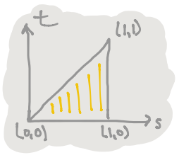
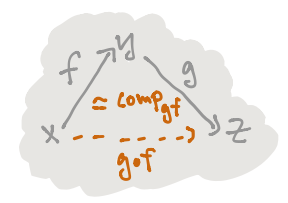

# Transcript: $\infty$-Category Theory for Undergraduates

> This is the transcript of the [slides] from Emily Riehl's talk
> *$\infty$-Category Theory for Undergraduates* ([video]), which is absolutely a
> great introduction to modern type theory and mathematics.

[slides]: http://www.math.jhu.edu/~eriehl/berkeley-logic.pdf
[video]: http://www.math.jhu.edu/~eriehl/berkeley-logic.mp4

* Berkeley Logic Colloquium
* Emily Riehl
* 7 May 2020

Thesis: If future undergraduates' foundational understanding of mathematical
proof were based on Homotopy Type Theory (HoTT) then we could teach them
$\infty$-category theory - much as we teach today's undergraduates abstract
algebra.

1. ACT I: Undergraduate-level informal HoTT
1. ACT II: $\infty$-category theory

## ACT I: Undergraduate-level informal HoTT

*Dependant type theory* is a formal system of inference rules, that combine to
form derivations.  There are four kinds of "well-formed formulas" called
*judgements*, including:

* $\Gamma \vdash A \  type$ - "$A$ is a type"
* $\Gamma \vdash a : A$ - "$a$ is a term of type $A$"

Here $\Gamma$ is a *context* which declares the types of any variables that
appear. e.g

* $\Gamma, x : A \vdash B(x) \  type$ - "a *family of types* over $A$"
* $\Gamma, x : A \vdash b(x) : B(x)$ - "a *family of terms*"

> * $n : \mathbb{N} \vdash \mathbb{R}^n \  type$
> * $n : \mathbb{N} \vdash \bar{0} : \mathbb{R}^n$

There are four kinds of *rules* (in place of axioms) that can be used in
derivations:

1. **Formation rules** form new types:
    * $^\times$*formation*: given types $A$ and $B$ there is a *product type*
    $A \times B$
    $$\frac{\Gamma \vdash A \  type \qquad \Gamma \vdash B \  type}{\Gamma \vdash A \times B \  type}$$
1. **Introduction rules** introduce new terms:
    * $^\times$*introduction*: given terms $a : A$ and $b : B$ there is a term
    $(a, b) : A \times B$
    $$\frac{\Gamma \vdash a : A \qquad \Gamma \vdash b : B}{\Gamma \vdash (a, b) : A \times B}$$
1. **Elimination rules** use the new terms:
    * $^\times$*elimination*: given a term $p : A \times B$ there are terms
    $pr_1(p) : A$ and $pr_2(p) : B$
    $$\frac{\Gamma \vdash p : A \times B}{\Gamma \vdash pr_1(p) : A}$$
    $$\frac{\Gamma \vdash p : A \times B}{\Gamma \vdash pr_2(p) : B}$$
1. **Computation rules** relate `2` and `3`

*Function types* are generated by the rules:

* $^\rightarrow$*formation*: given types $A$ and $B$, there is a type
$A \rightarrow B$
* $^\rightarrow$*introduction*: if in the *context of any term* $x : A$
there is a term $b(x) : B$, then there is a term
$\lambda x . b(x) : A \rightarrow B$
$$\frac{\Gamma, x : A \vdash b(x) : B}{\Gamma \vdash \lambda x . b(x) : A \rightarrow B}$$
* $^\rightarrow$*elimination*: given terms $f : A \rightarrow B$ and
$a : A$, there is a term $f(a) : B$
* And two *computation* rules[1](#footnote-1)

A proposition is **proven** by **constructing a term** in the type that encodes
its statement.

*Proposition:* For any types $P$ and $Q$, there is a term
$modus{\text -}ponens : P \times (P \rightarrow Q) \rightarrow Q$.

*Proof:* By $^\rightarrow$*introduction* we must explain how to use a term
$x : P \times (P \rightarrow Q)$ to prove a term of type $Q$.  By
$^\times$*elimination* from $x$ we get terms $pr_1(x) : P$ and
$pr_2(x) : P \rightarrow Q$.  By $^\rightarrow$*elimination* then
$(pr_2(x))(pr_1(x)) : Q$. Ie,
$modus{\text -}ponens :\equiv \lambda x . (pr_2(x))(pr_1(x))$. $\square$

Propositions concerning **mathematical equality** are governed by
Per Martin-Löf's *identity types*:

* $^=$*formation*: given a type $A$ and two terms $x, y : A$, there is a type
$x =_A y$
* $^=$*introduction*: given a term $x : A$, there is a term $refl_x : x =_A x$

The elimination rule for the identity type can be packaged into the principal of
*path induction*:

**Path induction:** Given any type family
$\Gamma, x, y : A, p : x =_A y \vdash B(x, y, p) \  type$, to produce a term of
type $B(x, y, p)$ it suffices to assume $y$ is $x$ and $p$ is $refl_x$.

*Lemma:* For any $x, y : A$, $(x =_A y) \rightarrow (y =_A x)$.

*Proof:* By $^\rightarrow$*introduction*, we may assume $p : x =_A y$, and
must produce a term of type $y =_A x$.  By *path induction*, to inhabit the type
family $B(x, y, p) :\equiv y =_A x$, it suffices to assume $y$ is $x$ and $p$ is
$refl_x$, in which case by $^=$*introduction* we have $relf_x : x =_A x$.
$\square$

*Lemma:* For any $x, y, z : A$,
$(x =_A y) \rightarrow ((y =_A z) \rightarrow (x =_A z))$.

*Proof:* By $^\rightarrow$*introduction*, we may assume $p : x =_A y$ and
$q : y =_A z$ and seek to inhabit $x =_A z$.  By *path induction* on $p$ and
then on $q$, we may assume $y$ and $z$ are $x$ and $p$ and $q$ are $refl_x$ in
which case by $^=$*introduction* we have $refl_x : x =_A x$. $\square$

The name *"path induction"* derives from the **homotopical interpretation** of
dependent type theory.

* a type $A$ $\leftrightsquigarrow$ a **"space"** $A$
* a term $a : A$ $\leftrightsquigarrow$ a **point** $a$ in $A$
* a term $p : x =_A y$ $\leftrightsquigarrow$ a **path** $p$ from $x$ to $y$ in
$A$
* a term $h : p =_{x =_A y} q$ $\leftrightsquigarrow$ a **homotopy** $h$ from
$p$ to $q$ in $A$

From this point of view, *symmetry* and *transitivity* of equality becomes
*reversals* and *compositions* of **paths**, and of **homotopies**, and of
**higher homotopies**, as summarized by a theorem of Lumsdaine and van den
Berg-Garner: types inherit the structure of an $\infty$-groupoid.

* a type family $\Gamma, x : A \vdash B(x) \  type$ $\leftrightsquigarrow$ a
**fibration** over $A$
* the *dependent sum* type $\sum\limits_{x : A} B(x)$ $\leftrightsquigarrow$ the
**total space** of a fibration
* the *dependent function* type $\prod\limits_{x : A} B(x)$
$\leftrightsquigarrow$ the space of **sections**

The homotopical interpretation inspired the following definitions:

* *Definition:* There **exists a unique** term of type $A$ just when the type
$\sum\limits_{a : A} \prod\limits_{x : A} a =_A x$ is inhabited, ie, just when
the "space" $A$ is *contractible*.

> Path induction expresses the contractibility of based path spaces!

* *Definition:* Types $A$ and $B$ are **equivalent** just when the following
type is inhabited:
$$A \simeq B :\equiv \sum\limits_{f : A \rightarrow B} (\sum\limits_{g : B \rightarrow A} \prod\limits_{a : A} g(f(a)) =_A a) \times (\sum\limits_{h : B \rightarrow A} \prod\limits_{b : B} f(h(b)) =_B b)$$

By the elimination rules for dependent sums and functions, a term in
$A \simeq B$ gives terms $f : A \rightarrow B$ and $g, h : B \rightarrow A$
together with **homotopies** $\alpha : \prod\limits_{a : A} g(f(a)) =_A a$ and
$\beta : \prod\limits_{b : B} f(h(b)) =_B b$.

By composing these one can show that $\prod\limits_{b : B} g(b) =_B h(b)$.  But
there is a good reason to define an **equivalence** to be a function
$f : A \rightarrow B$ equipped with a priori distinct *left and right inverses*:
given any
$x, y : (\sum\limits_{g : B \rightarrow A} \prod\limits_{a : A} g(f(a)) =_A a) \times (\sum\limits_{h : B \rightarrow A} \prod\limits_{b : B} f(h(b)) =_B b)$
then $x = y$, while the type
$\sum\limits_{g : B \rightarrow A} (\prod\limits_{a : A} g(f(a)) =_A a \times (\prod\limits_{b : B} f(g(b)) =_B b)$ might have distinct terms.

## ACT II: $\infty$-category theory for undergraduates

> Joint with Mike Shulman

We work in an extension of HoTT in which types are allowed to depend on
polytopes within *directed cubes*:

> Products of a directed interval $\mathbb{I}$, which has $0, 1 : \mathbb{I}$
> and $x, y : \mathbb{I} \vdash x \leq y$.

* $\Delta^n :\equiv \{ \langle t, ... tn \rangle : \mathbb{I}^n | t_n \leq \ldots \leq t_1 \}$
* $\partial \Delta^2 :\equiv \{ \langle s, t \rangle : \mathbb{I}^2 | (t \leq s) \land ((t = 0) \lor (t = s) \lor (s = 1)) \}$
* $\Lambda^2_1 :\equiv \{ \langle s, t \rangle : \mathbb{I}^2 | (t \leq s) \land ((t = 0) \lor (s = 1)) \}$

Given polytopes $\Phi \subset \Psi$ and a function $f : \Phi \rightarrow A$ we
may form an *extension type*:
$\left\langle\array{\Phi & \xrightarrow{f} & A \\ \downarrow & \nearrow & \\ \Psi & &}\right\rangle$
[2](#footnote-2)  whose terms are
$g : \Psi \rightarrow A$ so that $g |_{\Phi} \equiv f$.

> Confidential for grad students: semantics in Reedy fibrant bisimplicial sets

* *Definition:* Given $x, y : A$,
$hom_A(x, y) :\equiv \left\{ \array{ \partial\Delta' & \xrightarrow{x, y} & A \\ \downarrow & \nearrow & \\ \Delta' & & } \right\}$
[2](#footnote-2)  is the type of *arrow*
in $A$ from $x$ to $y$.
* *Definition:* A type $A$ is an *$\infty$-groupoid* if
$path{\text -}to{\text -}arr : x =_A y \rightarrow hom_A(x, y)$ is an
equivalence.

> $refl_x \mapsto id_x$

* *Definition:* A type $A$ is a *pre-$\infty$-category* if every composable pair
of arrows has **a unique composite**: for all $f : hom_A(x, y)$ and
$g : hom_A(y, z)$ the type
$\left\{ \array{ \Lambda^2_1 & \xrightarrow{f, g} & A \\ \downarrow & \nearrow & \\ \Delta^2 & & } \right\}$
[2](#footnote-2)  is contractible.
* *Notation:* Denote the **unique** inhabitant by:

In any *pre-$\infty$-category* $A$:

*Lemma:* Each $x : A$ has an *identity arrow* $id_x : hom_A(x, x)$ so that for
all $f : hom_A(x, y)$ and all $k : hom_A(w, x)$, $f \cdot id_x = f$ and
$id_x \cdot k = k$.

Proof: The constant function defines a term
$id_x :\equiv \lambda t . x : hom_A(x, x) :\equiv \left\{ \array{ \partial \Delta' & \xrightarrow{(x, x)} & A \\ \downarrow & \nearrow & \\ \Delta' & & } \right\}$
[2](#footnote-2) .
The type
$\left\{ \array{ \Lambda^2_1 & \xrightarrow{id_x, f} & A \\ \downarrow & \nearrow & \\ \Delta^2 & &} \right\}$
[2](#footnote-2)  is inhabited by
$\lambda s \lambda t, f(t) : \Delta^2 \rightarrow A$, proving
$f \circ id_x = f$. $\square$

(WIP)

## My notes

1.  [↑](#footnote-ref-1) The two computation rules are $\beta$*-reduction* and
$\eta$*-reduction*
1.  [↑](#footnote-ref-2) Some hook arrows and
dashed arrows are omitted for limitations of inline $\TeX$
